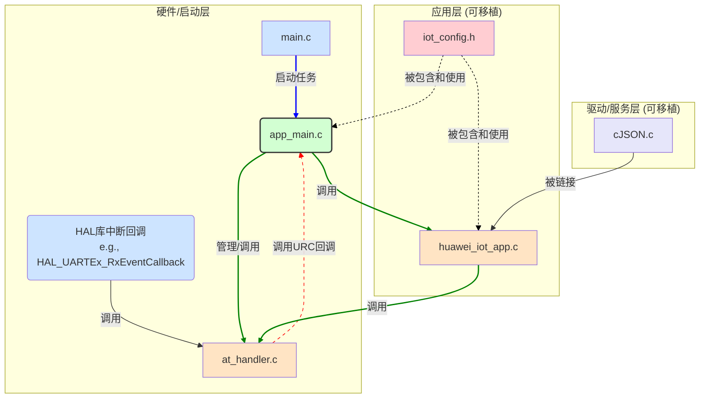

# STM32 物联网网关项目数据手册

**版本: 2.0**

## 1. 项目概述

本项目是一个基于 **STM32F407** 微控制器和 **FreeRTOS** 操作系统的、具备工业级稳定性的物联网网关。其核心功能是作为一个桥梁，通过 **AT 指令**与蜂窝通信模组（如 Air724）交互，连接到**华为云物联网平台**，并实现设备与云端之间的双向数据通信和命令控制。

项目经过精心设计和迭代，实现了应用逻辑与底层硬件的高度解耦，具备**极高的可靠性**（鲁棒的启动时序与运行中断线自动重连）、**高可扩展性**（命令分发器）和**高可移植性**（分层架构）的特点。

## 2. 系统架构

系统采用分层设计，将硬件驱动、应用逻辑和服务组件明确分离，确保了代码的清晰度和可维护性。

### 2.1. 架构图

### 2.2. 核心模块详解

#### **硬件/启动层**

*   `main.c`: **职责单一的启动器**。
    *   **功能**: 负责所有底层硬件（时钟、GPIO、DMA、UART）的初始化，并启动 FreeRTOS 调度器。其默认任务 `StartDefaultTask` 仅用于调用应用层的入口函数，本身不包含任何业务逻辑。

#### **应用层 (移植核心)**

*   `app_main.c` / `app_main.h`: **应用逻辑的"大脑"**。
    *   **功能**: 实现了设备的核心**状态机**，管理从上电、连接、运行到重连的整个生命周期。它是 `at_handler` 和 `huawei_iot_app` 的"总指挥"，负责调用它们完成具体任务，并处理来自 `at_handler` 的 URC 事件（如模组重启）以触发状态迁移。
    *   **可移植性**: 此模块包含了项目的全部业务逻辑，可以被整体移植到任何其他基于 FreeRTOS 的 STM32 工程中。

#### **驱动/服务层 (功能组件)**

*   `at_handler.c` / `at_handler.h`: **通用的 AT 命令处理器**。
    *   **功能**: 一个基于 **DMA+UART空闲中断** 的、完全异步的 AT 命令处理引擎。它使用 FreeRTOS 任务和信号量，提供了线程安全的、支持同步/异步命令发送和 URC 动态注册的强大框架。它完全独立于特定的 AT 指令集，具有极高的复用价值。

*   `huawei_iot_app.c` / `huawei_iot_app.h`: **华为云服务适配层**。
    *   **功能**: 封装了所有与华为云平台交互的业务。包括：连接云平台、上报子设备状态、解析云端命令。其内部实现了一个**命令分发器**，可以根据云端下发的 `command_name` 自动调用对应的本地处理函数。

*   `iot_config.h`: **集中式配置文件**。
    *   **功能**: 提供了对项目所有关键参数（服务器地址、设备证书、子设备列表）的一站式配置。修改此文件即可改变项目行为，无需触及任何逻辑代码。

*   `cJSON.c`: **JSON 解析/生成库**。
    *   **功能**: 为项目提供了稳定、高效的 JSON 格式数据处理能力，已被配置为使用 FreeRTOS 的内存管理函数，确保了在 RTOS 环境下的内存安全。

## 3. 核心机制详解

### 3.1. 鲁棒的启动与重连机制

为确保在各种复杂情况下（如首次上电、单片机意外复位、模组意外复位）系统都能进入正常工作状态，我们设计了一套结合**主动探测**与**被动监听**的混合式启动与重连机制。

**问题场景:**
1.  **冷启动时序竞争**: 单片机启动速度远快于通信模组，若单片机启动后立即发送AT指令，模组尚未就绪，必然导致失败。
2.  **单片机复位陷阱**: 若单片机因看门狗或电源波动而复位，但模组正常运行，此时模组已就绪，不会再发送 `+SIM READY` URC。如果系统只被动等待该URC，将陷入无限等待的死锁。
3.  **模组运行中复位**: 模组在正常工作时，可能因信号、供电等问题自行复位。

**解决方案 (由`app_main.c`的状态机实现):**

1.  **状态 `SYS_STATE_START` -> `SYS_STATE_WAIT_FOR_MODULE`**:
    *   系统启动或重连时，首先进入 `START` 状态，仅初始化 `AT_Handler` 的底层驱动（启动监听任务），然后立即切换到 `WAIT_FOR_MODULE` 状态。

2.  **状态 `SYS_STATE_WAIT_FOR_MODULE` (核心)**:
    *   **主动探测**: 系统在此状态下会周期性（每3秒）发送 `AT+CPIN?` 指令查询SIM卡状态。如果收到 `+CPIN: READY` 响应，证明模组和SIM卡都已就绪，系统切换到 `INITIALIZING` 状态。**此举完美解决了"单片机复位陷阱"问题**。
    *   **被动监听**: 同时，系统依然监听 `+SIM READY` URC。如果在轮询间隙收到了此URC，它会作为一个"快速通道"信号，同样将系统切换到 `INITIALIZING` 状态。**此举优化了冷启动速度**。

3.  **状态 `SYS_STATE_RUNNING` -> `SYS_STATE_RECONNECTING`**:
    *   在系统正常运行时，如果 `on_module_ready` 回调函数被触发（收到了 `+SIM READY`），则证明模组发生了意外复位。系统会切换到 `RECONNECTING` 状态。**此举解决了"模组运行中复位"问题**。

4.  **状态 `SYS_STATE_RECONNECTING` -> `SYS_STATE_START`**:
    *   在重连状态下，系统会先调用 `AT_DeInit` 彻底清理所有旧的资源（任务、信号量等），然后返回到 `START` 状态，**复用整套健壮的启动流程**，确保每次连接都在一个干净的环境下进行。

### 3.2. 其他关键特性

*   **非阻塞命令响应**: 对于云端下发的命令，采用"发后即忘"的非阻塞方式发送响应，避免了因等待响应而阻塞后续命令的处理，极大地提高了并发处理性能。
*   **可扩展的命令分发器**: 在 `huawei_iot_app.c` 中，可以非常方便地通过修改 `command_table` 数组来添加对新云端命令的支持，无需修改核心逻辑。
*   **高效的串口接收**: 基于 DMA 和 UART 空闲中断的 `at_handler` 极大降低了 CPU 在处理串口数据上的开销。
*   **完全的应用层/硬件层解耦**: 得益于 `app_main` 模块的引入，整个物联网应用逻辑可以作为一个"黑盒"被轻松移植。 